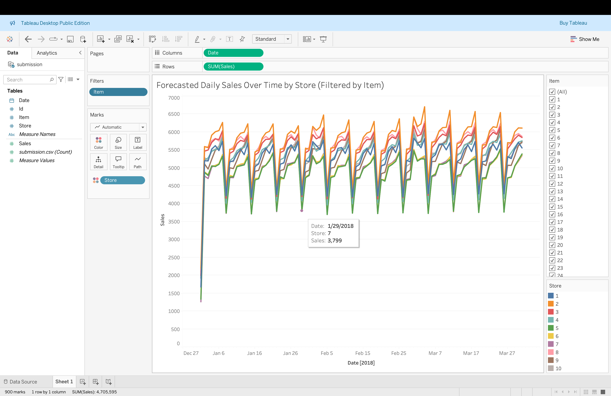
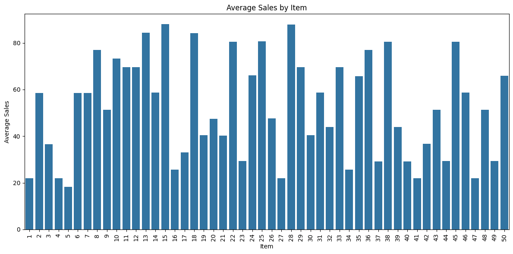
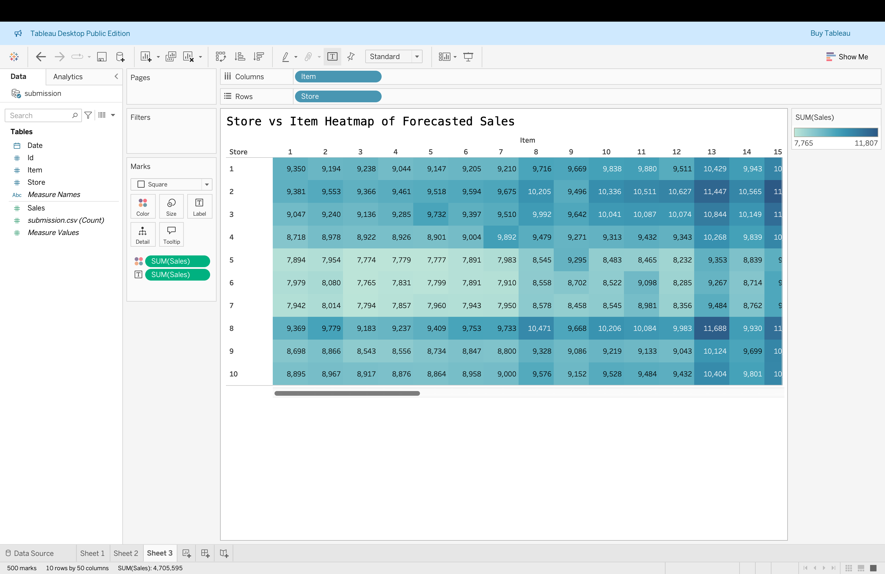
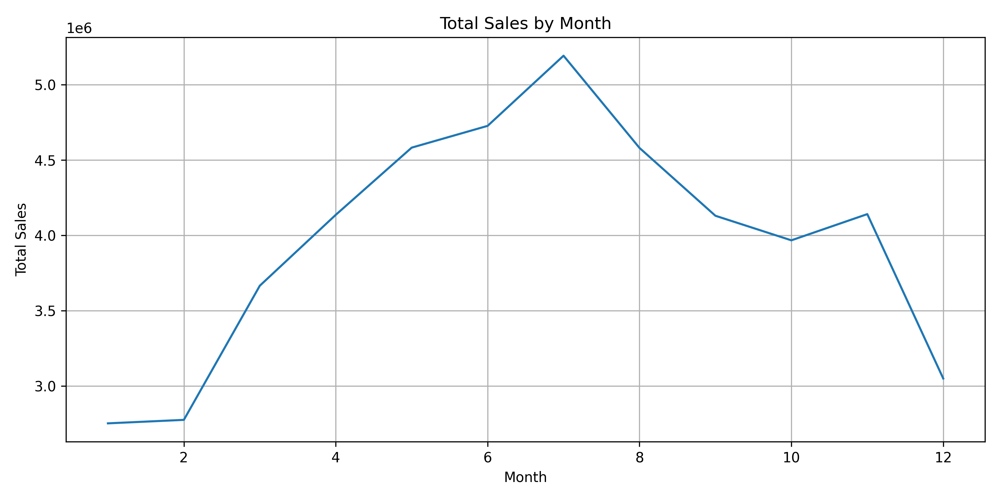
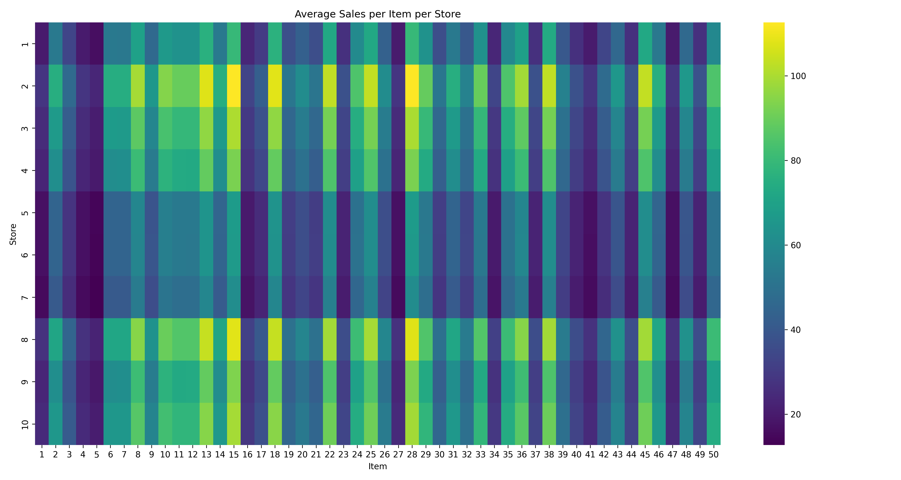

# 🛍️ Retail Demand Forecasting

This project forecasts daily sales for multiple store-item combinations using historical time-series data. It includes predictive modeling and interactive Tableau dashboards.

---

## 🔧 Tools & Tech
- Python: pandas, scikit-learn, XGBoost
- Tableau Public: Interactive dashboards
- Jupyter Notebook

---

## 📊 Visualizations

1. **Forecasted Daily Sales Over Time by Store (Filtered by Item)**  
   

2. **Total Forecasted Sales by Store**  
   

3. **Store vs Item Heatmap of Forecasted Sales**  
   

4. **Total Sales by Month**  
   

5. **Average Sales by Day of Week**  
   

6. **Average Sales per Item per Store**  
   


---

## 🧠 Key Highlights
- Created date-based and lag features for forecasting
- Compared models: Linear Regression, Random Forest, XGBoost
- Achieved RMSE improvement from 12.48 → 8.57
- Exported predictions to Tableau for powerful visual insights

---

## 📁 Dataset
Source: [Kaggle – Demand Forecasting](https://www.kaggle.com/competitions/demand-forecasting-kernels-only)

---

## 🗂 Project Structure

```
Retail_Demand_Forecasting/
├── data/
│   ├── train.csv
│   ├── test.csv
│   ├── sample_submission.csv
│   └── submission.csv
│
├── notebooks/
│   └── Retail_Demand_Forecasting.ipynb
│
├── images/
│   ├── forecasted_sales_over_time_by_store.png
│   ├── total_sales_by_store.png
│   └── store_vs_item_heatmap.png
│
├── .gitignore
├── LICENSE
├── README.md
```
